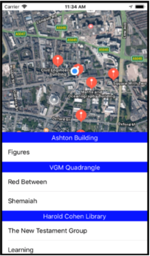

# Campus Artworks
**Campus Artworks** is an IOS application which is used to determine artworks' location surrounding the University of Liverpool (UoL) main campus.

> The application contains the map which desplays both a user current location and nearby artwork annotations. There are two kind of annotations including **artwork** and **building**. When the user click on the artwork annotation, the image and details of relevant artwork will be presented, while pressing the building annotation will show a list of artworks inside the building. Besides, a table below the map obtains titles of artwork which are grouped by their buildings as well as ordered by a distance from the user current location. Each title on the table is also clickable to immediately show information about any specific artworks.

This application has been developed by Ngoc Duy Pham to Victoria Gallery & Museum Liverpool under the supervision of **Mr. Phil Jimmieson**.

### Screenshots
**Main map view**

### Ethical User of Data
I have made use of some following other human data in order to accomplish this project.
- Data of artworks from the main server at University of Liverpool.
- The collection of artwork pictures accessed through base URLs from the university.